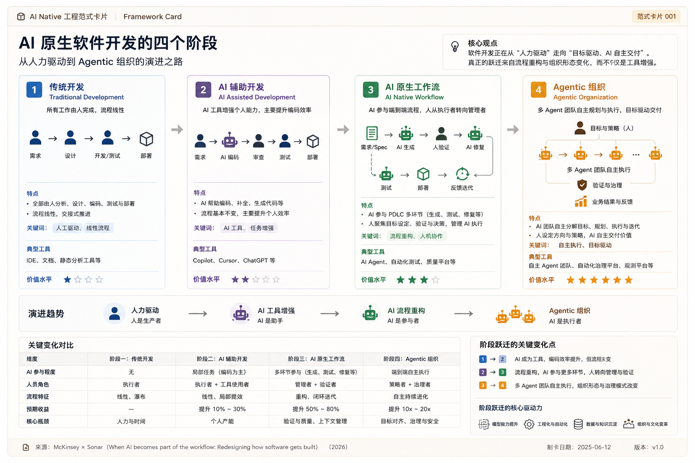

# Framework 001: AI Native Development Evolution

## 框架定义

AI Native Development Evolution 描述软件研发组织从传统人工研发，逐步演进到端到端 agentic workflow 的过程。它关注的不是“是否使用 AI”，而是“工作系统被 AI 重构到什么程度”。

## 四个阶段

| Stage | 名称 | 定义 | 人的角色 | AI 的角色 | 主要收益 | 主要瓶颈 |
|---|---|---|---|---|---|---|
| 1 | Traditional Development | 人完成大多数研发工作 | 执行者 | 基本无参与 | 稳定、可控 | 速度慢、交接损耗高 |
| 2 | AI Assisted Development | AI 增强局部任务 | 使用工具的人 | Coding / testing / debug assistant | 局部效率提升 | Workflow 没变，系统吞吐有限 |
| 3 | AI Native Workflow | PDLC 围绕 agent 重构 | 目标设定、上下文、验证 | 参与多环节执行和反馈 | 端到端效率提升 | 验证、治理、组织扩散 |
| 4 | Agentic Organization | Agent 系统端到端协同 | 编排系统、监督结果 | 多 agent 协同执行目标 | 潜在数量级提升 | 信任、责任、安全、复杂性 |

## 演进方向

```text
Manual Execution → Task Augmentation → Workflow Redesign → System Orchestration
```

## 阶段之间的关键变化

### Stage 1 → Stage 2

变化点是 AI 进入局部任务，但流程基本不变。典型动作是上线 coding assistant、自动测试生成或代码解释工具。

### Stage 2 → Stage 3

变化点是从工具采用转向工作流重构。团队开始标准化输入、外显上下文、让 agent 参与 backlog、测试、代码生成和修复，并把人放在验证和判断位置。

### Stage 3 → Stage 4

变化点是从单个 agent 或局部 agent workflow 转向 agent 系统编排。人定义目标、约束和验收标准，agent 系统协调完成端到端执行。

## 使用方式

这个框架适合用于判断一个团队的 AI Native 成熟度。不要只问团队用了多少 AI 工具，而要问：

1. 需求和上下文是否结构化到 agent 可执行？
2. AI 是否参与了 PDLC 多个环节，而不是只写代码？
3. 验证、治理和反馈是否嵌入工作流？
4. 人的角色是否从执行转向编排和监督？

## Visual Card


